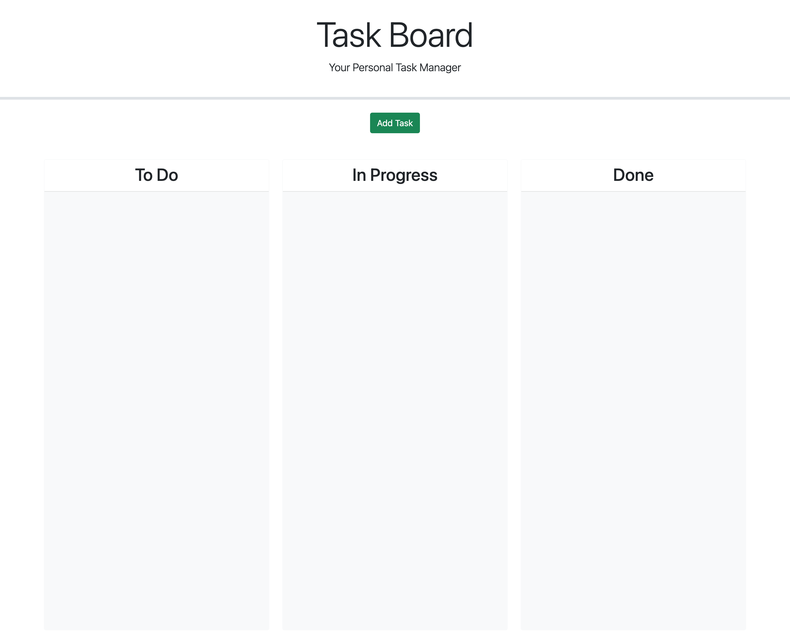

## Description

This app allows you to add your to-do as well as add a time/date. You can drag and drop each task according to the due date. 

## Visuals

## Deployment

LIVE LINK: ([Your_REPO_LINK](https://vgalante2.github.io/Task_Manager/))

## Usage

To use the webpage, you can review each section by clicking on the header links at the top of the page. To inspect each element, you can open the Chrome DevTools by pressing Command+Option+I (macOS) or Control+Shift+I (Windows). A console panel should open either below or to the side of the webpage in the browser. There you can navigate to the Accessibility tab to highlight each picture element,

## License

MIT License 
